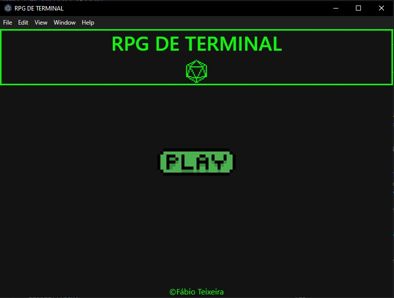

# TERMINAL RPG - FRONTEND + ELECTRON.JS

> Play an interactive, dynamically responsive RPG adventure! This software creates a unique experience with JavaScript and Electron.JS

Project link: [In development]

### Adjustments and improvements

The project is still under development and the next updates will focus on the following tasks:

- [x] Task 1 - Implement Electron.JS framework for a better game experience
- [x] Task 2 - Implement Bootstrap framework for better code responsiveness
- [ ] Task 3 - Character selection + animations
- [ ] Task 4 - Interactive main story with JavaScript
- [ ] Task 5 - Deploy the current version

## 💻 Prerequisites

Before you begin, make sure you meet the following requirements:

- A modern browser with JavaScript enabled (required for interactions and animations)
- Node.JS installed (to run the game in the Electron.JS window)

## 🤝 Collaborators

Independent project created by me: 

www.linkedin.com/in/eng-fabio-teixeira

